## 显示ValueError: Timeout value connect was ……, but it must be an int, float or None
是Selenium和urllib3版本不兼容的问题，降低urllib3的版本就好，当前使用 版本urllib3 为1.26.2,Selenium版本为3.141.0
链接：https://blog.csdn.net/weixin_60535956/article/details/131660133

##  selenium chromedriver unexpectedly exited. Status code was: -9
能正常运行一次，再想运行就会报错，更新了Chrome浏览器之后 运行起了一次，然后又报这个错了
https://cloud.tencent.com/developer/article/1365269

https://registry.npmmirror.com/binary.html?path=chromedriver/

总之就在Chrome浏览器和Chromedriver版本不兼容

https://googlechromelabs.github.io/chrome-for-testing/#stable

## PO模式
1. 增强测试维护
2. 减少代码重复
### 主要目录
- base 包用来存放元素定位
- page 包用来存放元素操作
- testcases 包用来存放测试用例
- common 包用来存放工具类
- config 包用来存放配置文件以及浏览器启动类
- logs 包用来存放日志

## 目录介绍
> base: 包括selenium二次封装以及各个页面元素的封装
> 
> common: 包括部分通用方法
>  
> config: 包括driver方法和配置文件
> 
> img: 存放图片
> 
> logs: 日志相关
> 
> page: 页面类
> 
> testcase: 测试用例

## YAML
- 大小写敏感
- 使用缩进表示层级关系
- 缩进不允许使用Tab，只能使用空格
- 缩进的空格数不重要，只要相同层级的元素左对齐即可
- #表示注释

YAML 数据类型
1. 纯量：单个的，不可再分的值
2. 数组
3. 对象

## Selenium
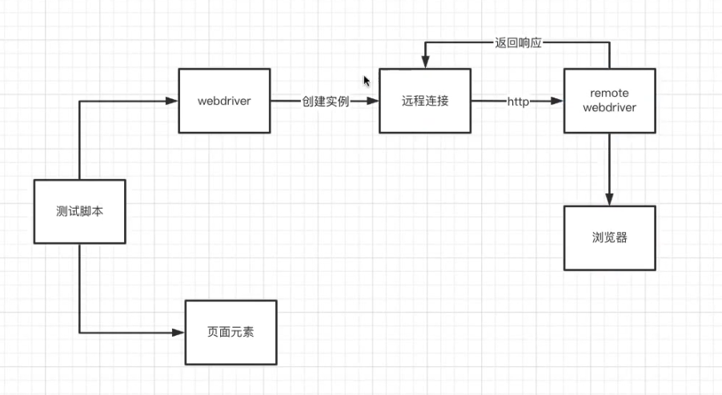
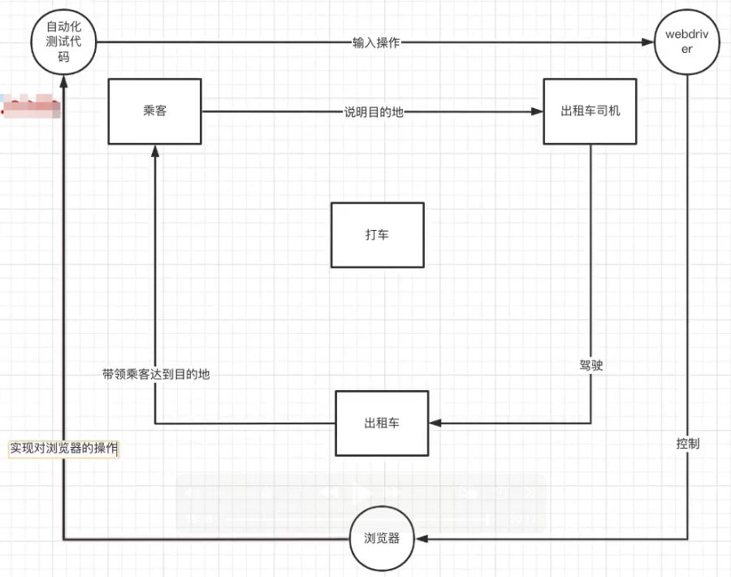

## 封装浏览器驱动  

下载对应浏览器的Chromedriver
进入路径 执行chmod +x chromedriver 

webdrivermanager 自动下载更新webdriver

## 元素定位方法
- CSS
- XPATH

//查找标签h1中class包含123的
//h1[contains(@class,'123')]

//查找标签h1中的值中包含123的
//h1[contains(text(),'123')]

## 前端主流框架

- React
- Vue
- Angular

获取元素的步骤

- 元素需不需要可见
- 元素如果可见，就返回元素定位；元素不可见，需要怎么操作
- 如果一直定位不到元素，应该怎么办

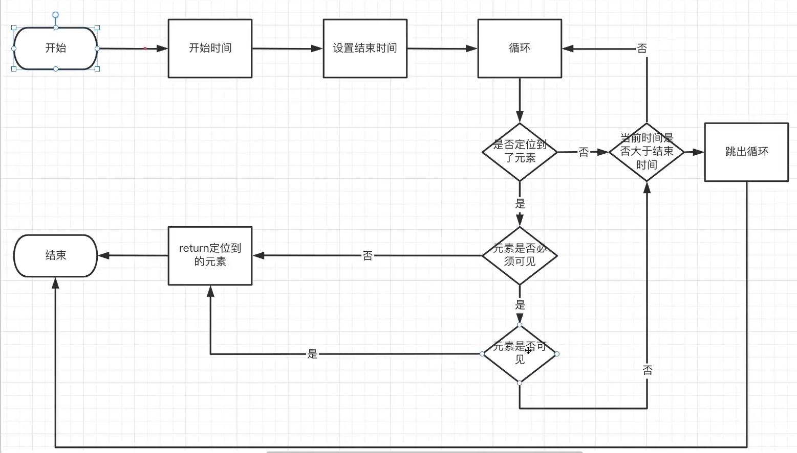

### 页面什么时候才算加载完成
在浏览器控制台 输出 document.readyState可以查看当前页面加载状态
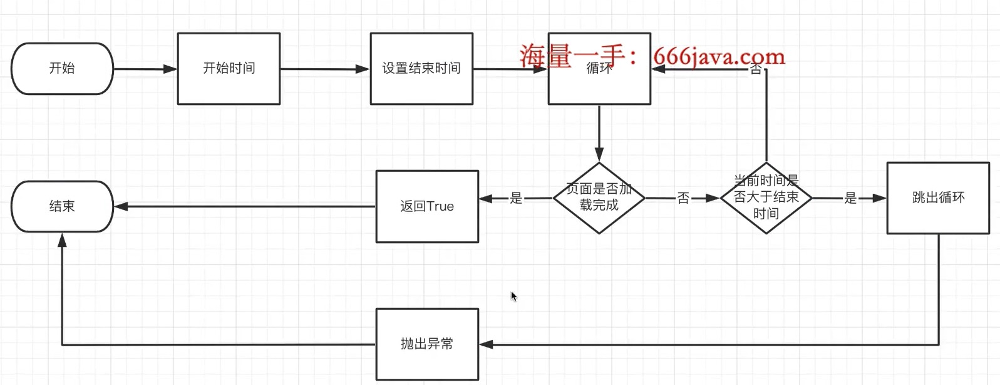

### 等待页面元素消失
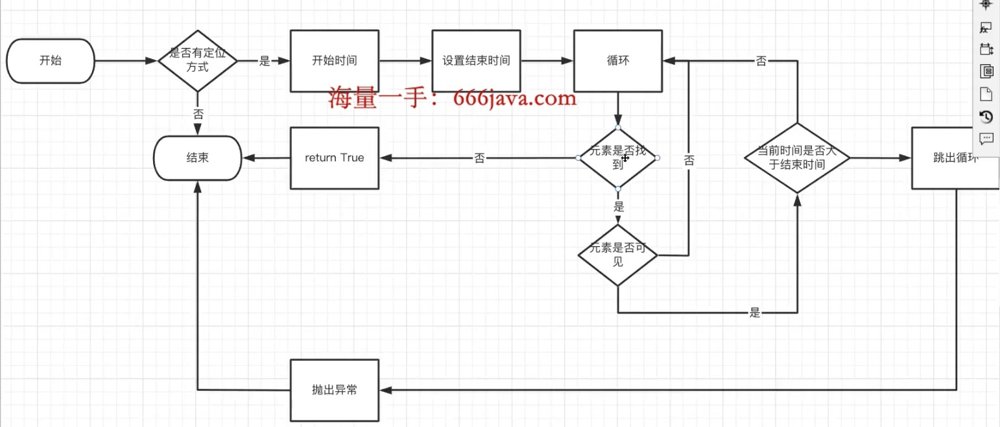

### 等待页面元素出现
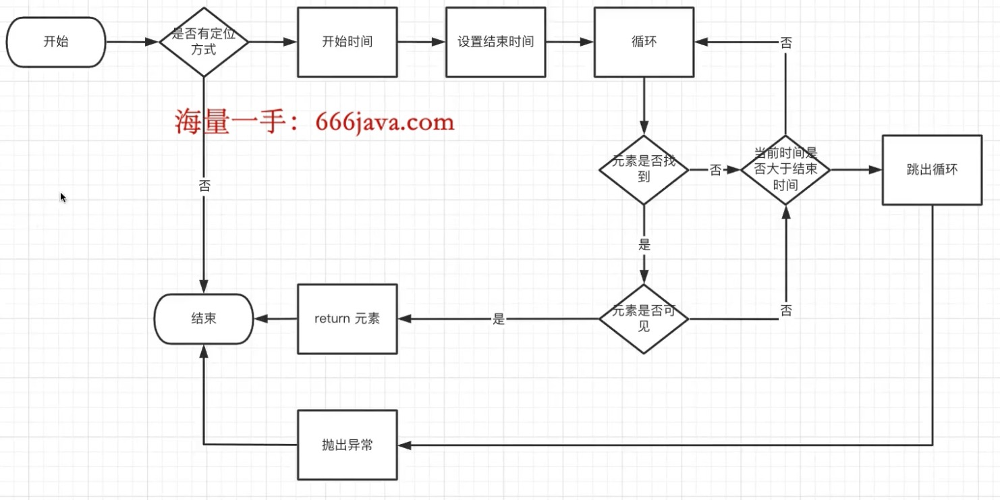

### 跳转到指定网站
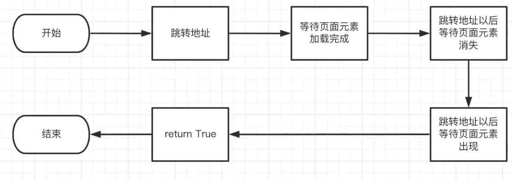

### 输入框填值逻辑
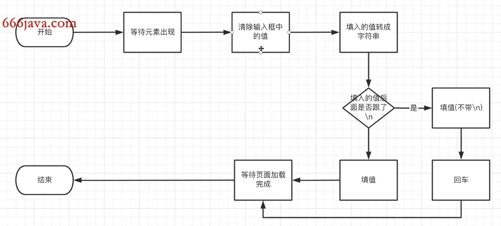

### 元素点击逻辑
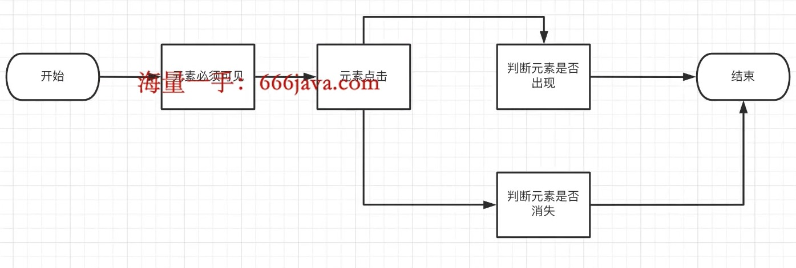

- iframe必须先切进去，测试完需要切出来

- 如果定位toast
F12 打开源代码，点击出现弹窗 在源代码处按F8 就可以让toast暂停

- 解决点击下拉框后无法定位里面元素
 定位到下拉框，右键->发生中断的条件->子树修改

### Pytest
Pytest是一个使构建简单，可伸缩的使测试变得容易的框架

#### Pytest规则
- .py文件要test_开头或_test结尾
- 测试类必须以Test开头，且不能有__init__方法
- 测试用例函数以test_开头
- 断言使用python原生assert

- 运行文件中所有测试用例
pytest testcases/test_pytests_m.py
- 运行指定文件中的指定测试用例(或者给需要执行的测试用例打上标记)
pytest testcases/test_pytests_m.py::TestPyTestMClass::test_open_baidu
 pytest -m baidu
- 同时运行两个测试用例
pytest -m "baidu or bing"
- 不执行某一个测试用例
pytest testcases/test_pytests_m.py -m "not baidu"
- 模糊匹配 (文件名/类名/方法名中包含指定内容)
pytest -k pytest
### Fixture
包裹测试用例
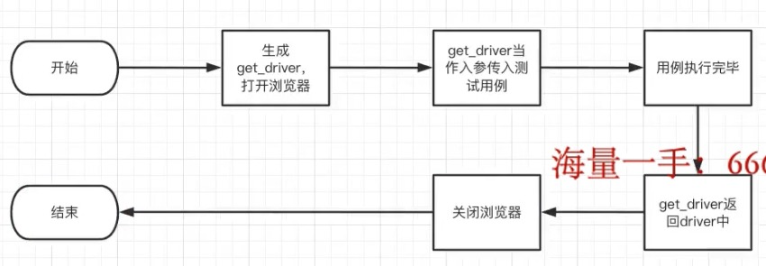
### conftest
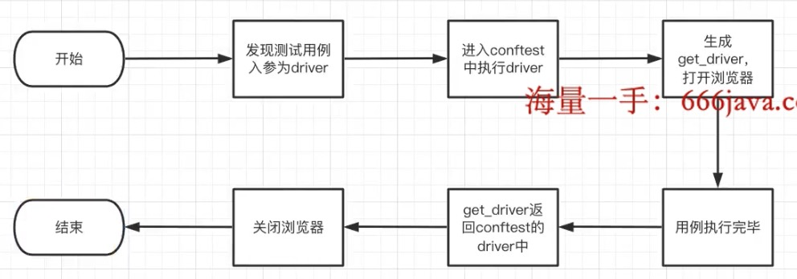
- conftest可以跨文件调用
- conftest的文件名是固定的
- 就近原则
- conftest不能呗其他文件导入
- conftest可以设置多个pytest内置的钩子函数

### pytest-xdist
并发执行测试用例
- pytest -n 3 指定并发数
- pytest -n auto 根据电脑CPU核心数自动指定并发数
- pytest -n auto --dist=loadscope 确保所有测试用例在一个进程中执行

### pytest-rerunfailures
-  pytest -s testcases/test_rerun.py --reruns 5 指定最多重跑5次
- pytest -s testcases/test_rerun.py --reruns 5 --reruns-delay 1 指定重跑5次,间隔1秒 
- @pytest.mark.flaky(reruns=5, reruns_delay=1) 代码中设置

### pytest-assume
断言，即使为假，后面也会执行 ，两种方式执行

### pytest-html 测试报告
- pytest -s -q testcases/test_switch_window_handle.py --html=report.html
- 执行完后会生成 assets文件夹，用于存放报告的样式，以及report.html显示测试结果
-  pytest -s -q testcases/test_switch_window_handle.py --html=report.html --self-contained-html 不生成单独的样式文件夹

### 图像识别在测试中的使用
- 登陆时的图像验证码
- App自动化测试 Airtest
- Web端UI自动化测试勇敢图像识别做断言

### Allure
-  pytest testcases/test_switch_window_handle.py --alluredir=UIreport
- allure generate UIreport -o UIreport/report 生成本地文件
- allure serve  UIreport 生成本地服务，可以在线浏览

### Jenkins

#### 持续集成的好处
  - 降低风险
  - 防止分支大幅偏离主干

#### 自动化测试使用Jenkins
  - 拉去Git仓库最新自动化测试代码
  - 执行自动化测试
  - 给出测试报告
  -  定时执行自动化测试

#### 本机安装Jenkins服务
  - 安装Java
  - 在Jenkins官网下载LTS版本的war包
  - 进入Jenkins下载目录 执行 java -jar jenkins.war --httpPort=8080
  - 复制生成的密码9dcefe002a7b4eea804a4397d2699a5b
  - 打开浏览器 进入localhost：8080
  - 输入上面复制的密码，选择安装推荐的插件
  - 等待相关插件下载完毕，设置账户密码
  - 点击保存，Jenkins的初始化就设置完毕了

#### Jenkins-Allure配置
- 在Jenkins中的插件管理中下载并安装allure
- 在系统管理中选择全局工具管理配置jdk
  - 设置别名，取消自动下载，选择java home 添加本地java路径 
- 配置完jdk选择配置maven，设置别名，选择自动下载
- 配置完后选择配置allure-commandline，设置别名，选择自动下载
- 点击保存

#### Jenkins构建自动化测试
- 在Jenkins中新建任务，选择自由风格
- 配置GitURL，在凭证中添加GitHub的账户密码
- 在构建环境中勾选Delete workspace before build starts
- 配置构建 Windows选择Windows，Mac或者Linux选择shell
- python -m pytest testcases\test_jenkins.py -n auto --alluredir=\Users\estim\.jenkins\workspace\二手交易平台自动化测试\allure-results
- 在选择构建后操作中选择Allure-Report
- 在构建触发器中设置定时任务 25 6 * * * 每天6。25执行
- 点击保存

### ddddocr
- https://github.com/sml2h3/ddddocr/issues/139 

### pymysql
开始-创建connection-获取cursor-执行DML语句-关闭cursor-关闭connection-结束